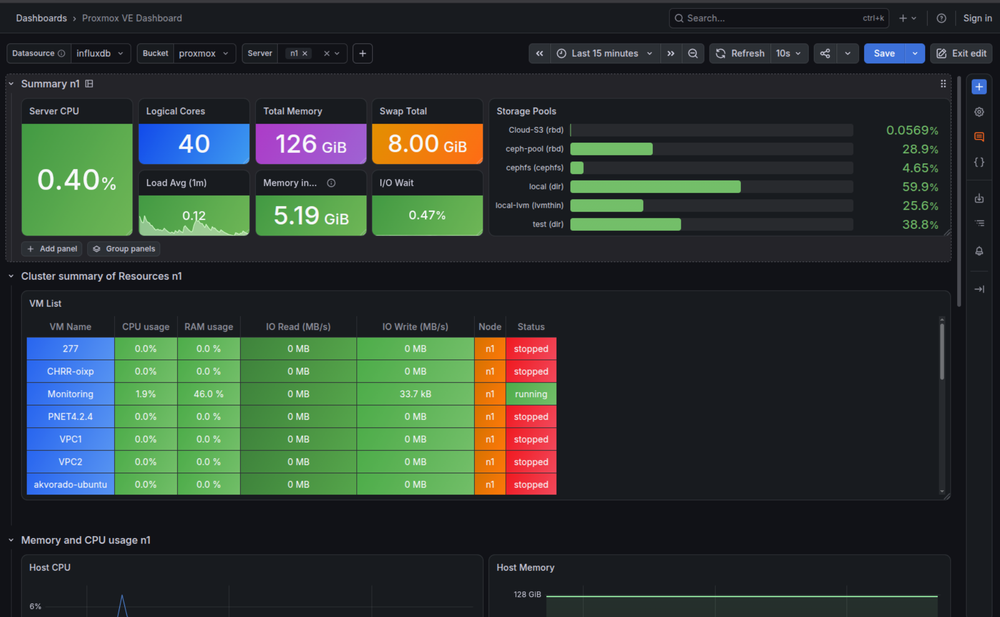

# Proxmox VE Monitoring dengan InfluxDB & Grafana

Dokumentasi ini berisi cara agar mengintegrasikan sistem **real-time monitoring Proxmox VE** menggunakan **InfluxDB** sebagai *Time-Series Database* dan **Grafana** sebagai platform visualisasi serta *alerting*.

Sistem ini dapat digunakan untuk memantau penggunaan **CPU, RAM, Network, storage**, dan metrik lainnya dari Proxmox VE serta mengirimkan notifikasi melalui **Telegram** ketika kondisi tertentu terpenuhi.

---

<p align="center">
  
</p>


---

## 🏗️ Arsitektur Sistem

```
┌────────────────┐      Metrics (v2 / Flux)      ┌──────────────┐
│  Proxmox VE    │ ────────────────────────────> │   InfluxDB   │
│   Hypervisor   │      Port 8086 / HTTP         │ (Time-Series)│
└────────────────┘                               └──────┬───────┘
                                                        │
                                                        │ Query (Flux)
                                                        v
┌────────────────┐      Push Notification        ┌──────────────┐
│  Telegram Bot  │ <──────────────────────────── │   Grafana    │
│  Alert Channel │                               │ (Dashboard)  │
└────────────────┘                               └──────────────┘

```


### Komponen

| Komponen     | Fungsi                          |   Port |
| ------------ | ------------------------------- | -----: |
| Proxmox VE   | Sumber metrik monitoring        |      8006 |
| InfluxDB     | Penyimpanan time-series metrics | `8086` |
| Grafana      | Dashboard & alerting            | `3000` |
| Telegram Bot | Pengiriman notifikasi alert     |  HTTPS |

---

# 🚀 Instalasi & Konfigurasi

## 1. Konfigurasi InfluxDB

Sebelum menghubungkan Proxmox VE, siapkan **Organization**, **Bucket**, dan **API Token** di InfluxDB.

### 1.1 Membuat Bucket

Buat bucket dengan nama:

```text
proxmox
```

Contoh struktur:

```text
Organization : <nama-organization>
Bucket       : proxmox
```

### 1.2 Membuat API Token

Buat API Token di InfluxDB yang memiliki permission:

```text
Read  → proxmox
Write → proxmox
```

> **Security:** Jangan memasukkan API Token ke repository Git atau membagikannya di dokumentasi publik.

Simpan token di tempat yang aman karena token tersebut akan digunakan oleh Proxmox dan Grafana.

---

# 2. Menghubungkan Proxmox VE ke InfluxDB

Masuk ke Proxmox VE melalui GUI:

```text
Datacenter
   └── Metric Server
          └── Add
               └── InfluxDB
```

Isi konfigurasi seperti berikut:

| Parameter    | Nilai                  |
| ------------ | ---------------------- |
| Name         | `InfluxDB-Proxmox`     |
| Server       | `<IP-INFLUXDB>`        |
| Port         | `8086`                 |
| Protocol     | `HTTP`                 |
| Organization | `<NAMA-ORGANIZATION>`  |
| Bucket       | `proxmox`              |
| Token        | `<INFLUXDB-API-TOKEN>` |

Jika InfluxDB menggunakan HTTP, gunakan:

```text
Protocol: HTTP
Port: 8086
```

### Contoh

```text
Server       : 192.168.10.20
Port         : 8086
Protocol     : HTTP
Organization : monitoring
Bucket       : proxmox
Token        : ********
```

Setelah konfigurasi disimpan, pastikan Proxmox dapat mengirimkan metrics ke InfluxDB.

---

# 📊 3. Integrasi Grafana

## 3.1 Menambahkan InfluxDB sebagai Data Source

Login ke Grafana, kemudian buka:

```text
Connections
   └── Data Sources
          └── Add data source
```

Pilih:

```text
InfluxDB
```

### Konfigurasi

#### Query Language

```text
Flux
```

#### URL

```text
http://<IP-INFLUXDB>:8086
```

Contoh:

```text
http://192.168.10.20:8086
```

#### Authentication

Jika InfluxDB tidak menggunakan Basic Authentication:

```text
Basic Auth: Disabled
```

### InfluxDB Details

```text
Organization : <NAMA-ORGANIZATION>
Token        : <INFLUXDB-API-TOKEN>
Default Bucket: proxmox
```

Kemudian klik:

```text
Save & Test
```

Pastikan Grafana berhasil terhubung ke InfluxDB.

---

# 📈 4. Membuat Dashboard Monitoring

Dashboard Grafana dapat digunakan untuk memantau berbagai metrik Proxmox, seperti:

* CPU Usage
* Memory Usage
* Network Traffic
* Disk I/O
* Storage Usage
* VM/Container Status
* Node Availability

Untuk metric berbasis persentase, seperti CPU dan RAM, disarankan menggunakan skala:

```text
Min : 0
Max : 100
Unit: Percent (0-100)
```

Dengan konfigurasi tersebut, grafik tetap menggunakan rentang `0–100%`.

---

# 📱 5. Integrasi Telegram

Grafana dapat mengirimkan alert melalui Telegram menggunakan **Contact Point**.

Secara umum alurnya:

```text
Grafana Alert Rule
       │
       ▼
Notification Policy
       │
       ▼
Telegram Contact Point
       │
       ▼
Telegram Bot
       │
       ▼
Telegram Group / Chat
```

Siapkan:

* Telegram Bot
* Bot Token
* Chat ID tujuan

Kemudian konfigurasi Telegram sebagai **Contact Point** di Grafana.

> **Security:** Bot Token Telegram merupakan credential rahasia. Jangan menyimpannya langsung di repository.

---

# ⏱️ 6. Notification Policy

Untuk sistem monitoring yang membutuhkan notifikasi cepat, contoh konfigurasi:

| Parameter       | Nilai |
| --------------- | ----: |
| Group Wait      |  `0s` |
| Group Interval  |  `1m` |
| Repeat Interval |  `1m` |

### Group Wait

```text
0s
```

Alert tidak menunggu terlalu lama sebelum notification group dikirim.

### Group Interval

```text
1m
```

Mengatur interval minimum pengiriman notification group berikutnya.

### Repeat Interval

```text
1m
```

Jika alert masih aktif, Grafana dapat mengirim ulang notifikasi berdasarkan interval tersebut.

> Hindari menggunakan `Repeat Interval` terlalu pendek pada alert yang sering aktif karena dapat menghasilkan banyak pesan dan berpotensi meningkatkan risiko rate limiting.

---

## 🛡️ 7. Mengurangi Alert Flapping

Gunakan:

```text
Keep Firing For: 30s
```

untuk membantu mencegah perubahan status alert yang terlalu cepat ketika metric naik-turun di sekitar threshold.
Tanpa mekanisme yang sesuai, kondisi seperti ini dapat menghasilkan:

```text
Firing
   ↓
Resolved
   ↓
Firing
   ↓
Resolved
```

yang menyebabkan terlalu banyak notifikasi.

---

## 🔍 8. Alert Terlambat

Periksa beberapa komponen berikut:

```text
Alert Rule
    ↓
Evaluation Interval
    ↓
Pending Period
    ↓
Notification Policy
    ↓
Contact Point
    ↓
Telegram API
```

Contoh konfigurasi untuk respons cepat:

```text
Evaluation Interval : 10s
Pending Period      : 0s
Group Wait          : 0s
```

Namun, perlu diingat bahwa **tidak ada jaminan notifikasi Telegram akan diterima tepat dalam hitungan detik**, karena masih bergantung pada proses evaluasi Grafana, jaringan, dan layanan Telegram.

---

# 🧪 9. Checklist Deployment


Gunakan checklist berikut setelah instalasi:

```text
[✅] InfluxDB sudah aktif
[✅] Bucket "proxmox" sudah dibuat
[✅] API Token sudah dibuat
[✅] Proxmox sudah terhubung ke InfluxDB
[✅] Metrics Proxmox sudah masuk ke InfluxDB
[✅] Grafana sudah terhubung ke InfluxDB
[✅] Dashboard sudah dibuat
[✅] CPU/RAM panel sudah dikonfigurasi
[✅] Alert Rule sudah dibuat
[✅] Telegram Bot sudah dikonfigurasi
[✅] Contact Point sudah diuji
[✅] Notification Policy sudah dikonfigurasi

```

---

# 📌 10. Ringkasan

Arsitektur monitoring yang digunakan:

```text
                ┌─────────────┐
                │ Proxmox VE  │
                └──────┬──────┘
                       │
                    Metrics
                       │
                       ▼
                ┌─────────────┐
                │  InfluxDB   │
                │    :8086    │
                └──────┬──────┘
                       │
                    Flux Query
                       │
                       ▼
                ┌─────────────┐
                │   Grafana   │
                │ Dashboard   │
                │  Alerting   │
                └──────┬──────┘
                       │
                   Notification
                       │
                       ▼
                ┌─────────────┐
                │   Telegram  │
                │     Bot     │
                └─────────────┘
```

Dengan kombinasi **Proxmox VE + InfluxDB + Grafana + Telegram**, monitoring dapat dibuat terpusat sehingga kondisi resource dan gangguan pada infrastruktur dapat dipantau melalui dashboard serta mendapatkan notifikasi ketika threshold tertentu tercapai.
